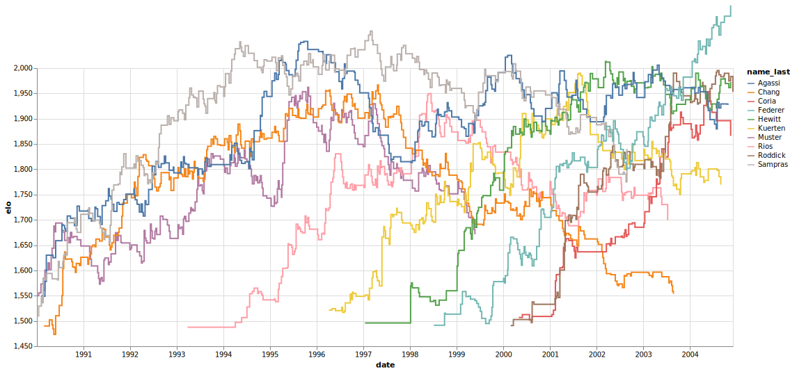

# Tennis Elo ratings

Code to calculate and plot Elo ratings for tennis players using Clojure. This was mainly to test out some of the data science tools that have been developed for Clojure.  

Data from Jeff Sackmann [https://github.com/JeffSackmann](https://github.com/JeffSackmann)

This plot (created with VegaLite through the [Oz](https://github.com/metasoarous/oz) package) shows the Elo ratings of the top 10 players over time between 1990 and 2005.

